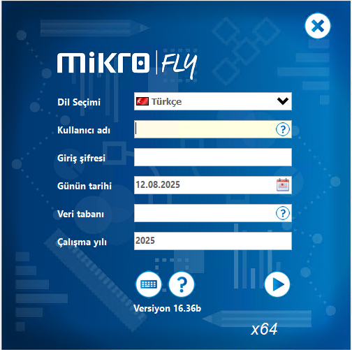
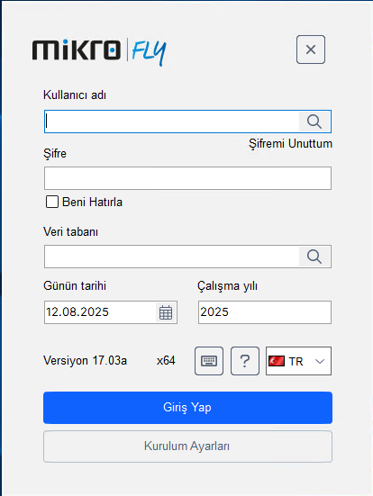
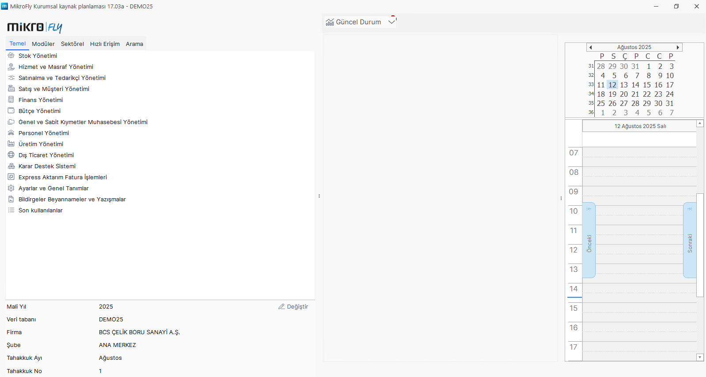

# Mikro Muhasebe Programı

## Program Açıklaması

Mikro Muhasebe Programı, küçük ve orta ölçekli işletmelerin (KOBİ) finansal süreçlerini kolay, hızlı ve güvenilir bir şekilde yönetmeleri için tasarlanmış bir muhasebe yazılımıdır. Kullanıcı dostu arayüzü, muhasebe bilgisi sınırlı kullanıcılar için erişilebilir bir deneyim sunarken, karmaşık finansal süreçleri eksiksiz yönetmek için gerekli tüm araçları sağlar. Türkiye’deki güncel vergi ve muhasebe mevzuatına tam uyumluluğu ile işletmelerin yasal yükümlülüklerini sorunsuz yerine getirmelerine destek olur. Mikro, finansal süreçleri dijitalleştirerek operasyonel verimliliği artırır, hata riskini azaltır ve stratejik karar alma süreçlerini güçlendirir.

---

### Temel Özellikler

- Gelir-Gider Takibi  
- Fatura ve Fiş İşlemleri  
- Stok ve Cari Hesap Yönetimi  
- Raporlama ve Analiz  
- Yasal Mevzuata Uyum  

---

### Mikro V16 Veritabanı Yapısı ve Teknik Altyapı

Mikro V16, modern, güvenli ve yüksek performanslı bir SQL tabanlı ilişkisel veritabanı mimarisi üzerine inşa edilmiştir. Bu altyapı, işletmelerin finansal verilerini organize, hızlı ve güvenli bir şekilde saklamasını, işleme kapasitesini artırmasını ve karmaşık finansal süreçleri hatasız bir şekilde yönetmesini sağlar.

Veritabanı tasarımı, veri bütünlüğünü ve tutarlılığını korurken, yüksek hacimli veri işleme, esnek entegrasyonlar ve ölçeklenebilirlik gibi modern işletme ihtiyaçlarını karşılar. Mikro V16 ve V17’nin teknik altyapısı, hem küçük ölçekli işletmelerin basit ihtiyaçlarına hem de orta ölçekli firmaların karmaşık finansal süreçlerine uyum sağlayacak şekilde tasarlanmıştır.

---

### Veri Aktarımı ve Entegrasyon

- **DB Exim:** Veri aktarımı için Mikro’nun özel aracı (Excel, CSV vb. destekler)  
- **ASCII ve XML Desteği:** Yaygın veri formatları ile diğer sistemlerle kolay entegrasyon  
- **API Entegrasyonları:** e-Ticaret platformları, ödeme sistemleri ve diğer uygulamalarla otomatik veri akışı  
- **INSERT Kodları:** Belirli BPM uygulamaları ile veri akışı  

---

### Raporlama ve Stratejik Analiz

Mikro Muhasebe, gelir-gider dengesi, bilanço, kar-zarar ve nakit akış raporları ile işletmenizin finansal sağlığını anlık takip etmenize imkan tanır. Özelleştirilebilir raporlar ve geçmiş verilere dayalı analizler, stratejik karar alma süreçlerinizi destekler.

---

## Program Versiyonları

Mikro Yazılım, farklı işletme ölçekleri ve ihtiyaçlarına uygun olarak çeşitli program versiyonları sunar.

- **Mikro V16** – Geleneksel masaüstü tabanlı versiyon, yüksek stabilite ve geniş modül desteği sunar. Özellikle uzun süredir Mikro kullanan firmalar tarafından tercih edilir.  
- **Mikro V17** – V16’nın geliştirilmiş, daha modern arayüz ve gelişmiş veri işleme yeteneklerine sahip versiyonu. Yeni nesil işletim sistemleri ve altyapılarla uyumlu çalışır.  
- **Jump** – Küçük ölçekli işletmeler için bulut tabanlı, esnek ve uygun maliyetli çözüm. Temel muhasebe, stok ve fatura işlemlerine odaklanır.  
- **Run** – Orta ölçekli işletmelere yönelik, hem bulut hem masaüstü desteği bulunan, geniş raporlama ve entegrasyon imkanları sunan versiyon.  
- **Fly** – Büyük ölçekli işletmeler ve karmaşık operasyonlar için tasarlanmış, ileri seviye ERP modülleri, gelişmiş otomasyon ve yüksek entegrasyon kapasitesine sahip üst düzey çözüm.

## En Çok Kullanılan Alanlar

### 1. Fatura Yönetimi
Mikro Muhasebe Programı’nda fatura yönetimi, işletmelerin satış ve alış faturalarını oluşturması, düzenlemesi ve takip etmesi için en çok kullanılan alanlardan biridir. E-fatura ve e-arşiv entegrasyonları sayesinde dijital faturalandırma süreçleri kolayca yönetilir. Bu alanda satış ve alış faturalarının oluşturulması, toplu fatura gönderimi, ödeme durumlarının izlenmesi gibi işlemler yapılır. Satış yapan işletmeler, serbest meslek erbapları ve muhasebeciler tarafından yoğun olarak kullanılır.

---

### 2. Gelir-Gider Takibi
İşletmelerin gelir ve giderlerini sistematik şekilde kaydederek finansal durumlarını anlık izlemelerine imkan tanır. Gelir-gider kalemleri sınıflandırılabilir, kasa ve banka hareketleri kaydedilebilir, ödeme-tahsilat süreçleri takip edilebilir. Küçük işletmeler, muhasebe departmanları ve mali müşavirler tarafından tercih edilir.

---

### 3. Cari Hesap Yönetimi
Müşteri ve tedarikçi hesaplarının takibini sağlar. Alacak-borç durumları, mutabakat işlemleri ve ödeme planları bu modülde yönetilir. Toptancılar, perakendeciler ve yoğun müşteri/tedarikçi ilişkisi olan işletmelerin sık kullandığı bir alandır.

---

### 4. Stok Yönetimi
Ürün hareketlerini ve stok seviyelerini detaylı şekilde izleme imkanı sunar. Depo yönetimi, barkod entegrasyonu ve maliyet analizi yapılabilir. Üretim firmaları, perakende işletmeleri ve depolar tarafından kullanılır.

---

### 5. Banka ve Kasa İşlemleri
Banka hesapları ve kasa hareketlerinin takibini sağlar. Çek-senet işlemleri, otomatik ödeme-tahsilat ve banka entegrasyonları desteklenir. Finans departmanları ve muhasebeciler tarafından yoğun olarak tercih edilir.

---

### 6. Finansal Raporlama
Bilanço, gelir tablosu, mizan gibi temel finansal raporların yanı sıra KDV ve stopaj raporları sunar. Özelleştirilebilir analiz imkanı ile muhasebeciler, mali müşavirler ve işletme sahipleri tarafından aktif olarak kullanılır.

---

### 7. E-Dönüşüm Entegrasyonları (E-Fatura, E-Defter, E-Arşiv)
E-fatura, e-defter ve e-arşiv işlemlerini yasal mevzuata uygun şekilde dijital ortamda yönetir. Gelir İdaresi Başkanlığı (GİB) entegrasyonu sayesinde resmi yükümlülükler kolayca yerine getirilir. E-fatura mükellefi olan işletmeler ve mali müşavirler tarafından kullanılır.

---

### 8. Personel ve Bordro Yönetimi
Maaş ve prim hesaplamaları, SGK bildirgeleri, izin ve mesai takibi gibi insan kaynakları süreçlerini kolaylaştırır. İnsan kaynakları departmanları ve muhasebe birimleri tarafından kullanılır.

---

### 9. Üretim Modülü
Üretim planlaması, hammadde ve yarı mamul takibi, maliyet hesaplamaları gibi süreçleri yönetir. Özellikle Mikro Fly sürümünde gelişmiş özelliklerle sunulur. Üretim firmaları ve imalatçılar tarafından tercih edilir.

## Mikro Insert ve Tablo Yapısı

Mikro Muhasebe Programı’nın veritabanı yapısı, birbirine bağlı tablolar üzerinden organize edilmiştir. Genel olarak:  

- **GUID Kolonu:**  
  Tüm tablolarda bulunan benzersiz kimlik alanıdır (GUID). Bazı tabloları birbirine bağlamak için bu GUID yapısı kullanılır.  

- **İndeks ve UNIQUE Alanlar:**  
  Her veritabanında, boş geçilemeyen ve benzersiz (UNIQUE) olan alanlar bulunur. Bu alanlar boş bırakıldığında, INSERT işlemi başarısız olur.  
  Örnek olarak, evrak sıra numarası ve evrak serileri bu UNIQUE alanlara örnektir.  

- **Satırlı Yapılar için Satır Numarası:**  
  Eğer bir tablo içinde satır satır veri tutuluyorsa, satır numarası alanı dikkate alınır ve bu alan satırların doğru sıralanması için kullanılır.  

Bu yapı sayesinde, veriler hem tutarlı hem de ilişkilendirilmiş biçimde saklanır, INSERT işlemleri güvenli ve doğru şekilde gerçekleştirilir.  
