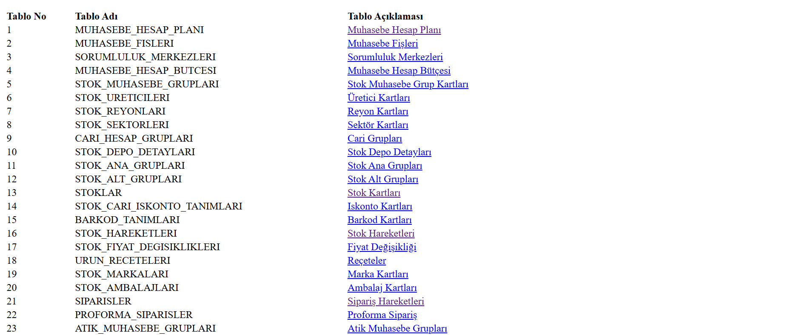
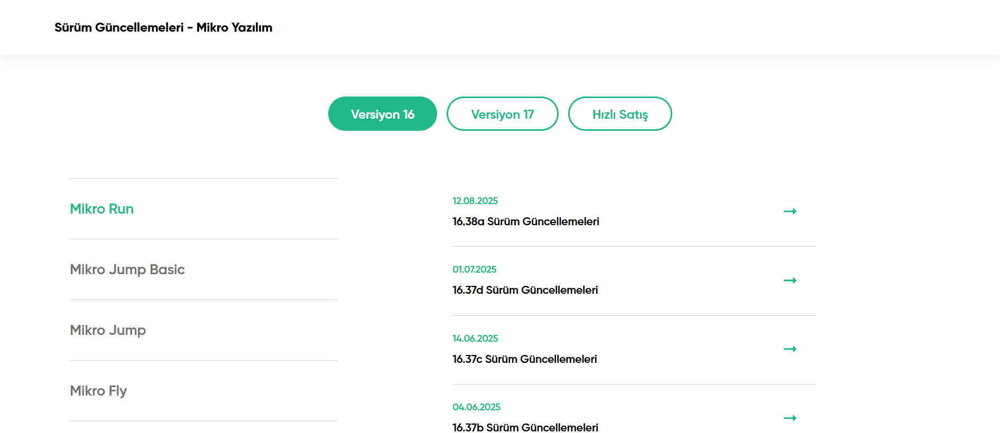
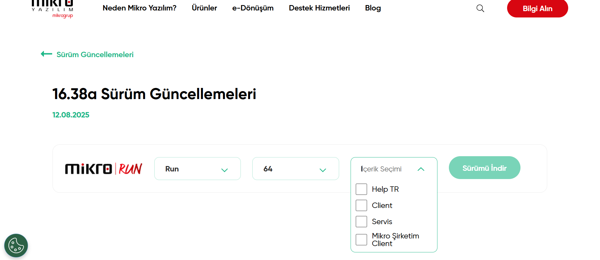
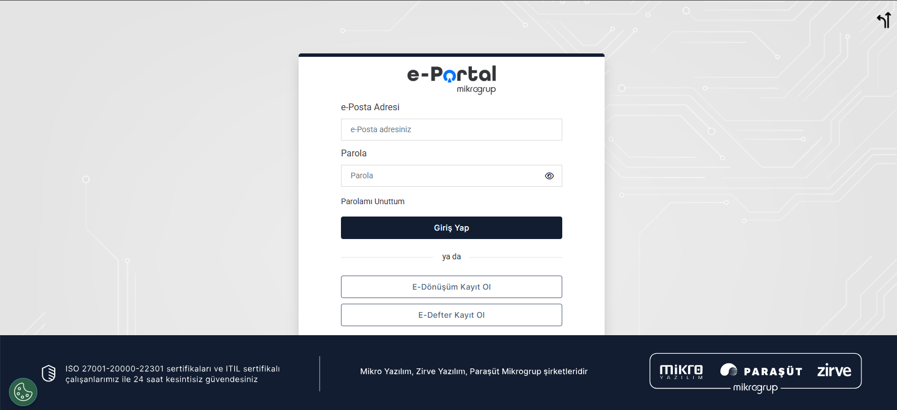

# Mikro Muhasebe Programı

## Program Açıklaması

Mikro Muhasebe Programı, küçük ve orta ölçekli işletmelerin (KOBİ) finansal süreçlerini kolay, hızlı ve güvenilir bir şekilde yönetmeleri için tasarlanmış bir muhasebe yazılımıdır. Kullanıcı dostu arayüzü, muhasebe bilgisi sınırlı kullanıcılar için erişilebilir bir deneyim sunarken, karmaşık finansal süreçleri eksiksiz yönetmek için gerekli tüm araçları sağlar. Türkiye’deki güncel vergi ve muhasebe mevzuatına tam uyumluluğu ile işletmelerin yasal yükümlülüklerini sorunsuz yerine getirmelerine destek olur. Mikro, finansal süreçleri dijitalleştirerek operasyonel verimliliği artırır, hata riskini azaltır ve stratejik karar alma süreçlerini güçlendirir.

---

### Temel Özellikler

- Gelir-Gider Takibi  
- Fatura ve Fiş İşlemleri  
- Stok ve Cari Hesap Yönetimi  
- Raporlama ve Analiz  
- Yasal Mevzuata Uyum  

---

### Mikro V16 Veritabanı Yapısı ve Teknik Altyapı

Mikro V16, modern, güvenli ve yüksek performanslı bir SQL tabanlı ilişkisel veritabanı mimarisi üzerine inşa edilmiştir. Bu altyapı, işletmelerin finansal verilerini organize, hızlı ve güvenli bir şekilde saklamasını, işleme kapasitesini artırmasını ve karmaşık finansal süreçleri hatasız bir şekilde yönetmesini sağlar.

Veritabanı tasarımı, veri bütünlüğünü ve tutarlılığını korurken, yüksek hacimli veri işleme, esnek entegrasyonlar ve ölçeklenebilirlik gibi modern işletme ihtiyaçlarını karşılar. Mikro V16 ve V17’nin teknik altyapısı, hem küçük ölçekli işletmelerin basit ihtiyaçlarına hem de orta ölçekli firmaların karmaşık finansal süreçlerine uyum sağlayacak şekilde tasarlanmıştır.

---

### Veri Aktarımı ve Entegrasyon

- **DB Exim:** Veri aktarımı için Mikro’nun özel aracı (Excel, CSV vb. destekler)  
- **ASCII ve XML Desteği:** Yaygın veri formatları ile diğer sistemlerle kolay entegrasyon  
- **API Entegrasyonları:** e-Ticaret platformları, ödeme sistemleri ve diğer uygulamalarla otomatik veri akışı  
- **INSERT Kodları:** Belirli BPM uygulamaları ile veri akışı  

---

### Raporlama ve Stratejik Analiz

Mikro Muhasebe, gelir-gider dengesi, bilanço, kar-zarar ve nakit akış raporları ile işletmenizin finansal sağlığını anlık takip etmenize imkan tanır. Özelleştirilebilir raporlar ve geçmiş verilere dayalı analizler, stratejik karar alma süreçlerinizi destekler.

---

## Program Versiyonları

Mikro Yazılım, farklı işletme ölçekleri ve ihtiyaçlarına uygun olarak çeşitli program versiyonları sunar.

- **Mikro V16** – Geleneksel masaüstü tabanlı versiyon, yüksek stabilite ve geniş modül desteği sunar. Özellikle uzun süredir Mikro kullanan firmalar tarafından tercih edilir.  
- **Mikro V17** – V16’nın geliştirilmiş, daha modern arayüz ve gelişmiş veri işleme yeteneklerine sahip versiyonu. Yeni nesil işletim sistemleri ve altyapılarla uyumlu çalışır.  
- **Jump** – Küçük ölçekli işletmeler için bulut tabanlı, esnek ve uygun maliyetli çözüm. Temel muhasebe, stok ve fatura işlemlerine odaklanır.  
- **Run** – Orta ölçekli işletmelere yönelik, hem bulut hem masaüstü desteği bulunan, geniş raporlama ve entegrasyon imkanları sunan versiyon.  
- **Fly** – Büyük ölçekli işletmeler ve karmaşık operasyonlar için tasarlanmış, ileri seviye ERP modülleri, gelişmiş otomasyon ve yüksek entegrasyon kapasitesine sahip üst düzey çözüm.

## En Çok Kullanılan Alanlar

### 1. Fatura Yönetimi
Mikro Muhasebe Programı’nda fatura yönetimi, işletmelerin satış ve alış faturalarını oluşturması, düzenlemesi ve takip etmesi için en çok kullanılan alanlardan biridir. E-fatura ve e-arşiv entegrasyonları sayesinde dijital faturalandırma süreçleri kolayca yönetilir. Bu alanda satış ve alış faturalarının oluşturulması, toplu fatura gönderimi, ödeme durumlarının izlenmesi gibi işlemler yapılır. Satış yapan işletmeler, serbest meslek erbapları ve muhasebeciler tarafından yoğun olarak kullanılır.

---

### 2. Gelir-Gider Takibi
İşletmelerin gelir ve giderlerini sistematik şekilde kaydederek finansal durumlarını anlık izlemelerine imkan tanır. Gelir-gider kalemleri sınıflandırılabilir, kasa ve banka hareketleri kaydedilebilir, ödeme-tahsilat süreçleri takip edilebilir. Küçük işletmeler, muhasebe departmanları ve mali müşavirler tarafından tercih edilir.

---

### 3. Cari Hesap Yönetimi
Müşteri ve tedarikçi hesaplarının takibini sağlar. Alacak-borç durumları, mutabakat işlemleri ve ödeme planları bu modülde yönetilir. Toptancılar, perakendeciler ve yoğun müşteri/tedarikçi ilişkisi olan işletmelerin sık kullandığı bir alandır.

---

### 4. Stok Yönetimi
Ürün hareketlerini ve stok seviyelerini detaylı şekilde izleme imkanı sunar. Depo yönetimi, barkod entegrasyonu ve maliyet analizi yapılabilir. Üretim firmaları, perakende işletmeleri ve depolar tarafından kullanılır.

---

### 5. Banka ve Kasa İşlemleri
Banka hesapları ve kasa hareketlerinin takibini sağlar. Çek-senet işlemleri, otomatik ödeme-tahsilat ve banka entegrasyonları desteklenir. Finans departmanları ve muhasebeciler tarafından yoğun olarak tercih edilir.

---

### 6. Finansal Raporlama
Bilanço, gelir tablosu, mizan gibi temel finansal raporların yanı sıra KDV ve stopaj raporları sunar. Özelleştirilebilir analiz imkanı ile muhasebeciler, mali müşavirler ve işletme sahipleri tarafından aktif olarak kullanılır.

---

### 7. E-Dönüşüm Entegrasyonları (E-Fatura, E-Defter, E-Arşiv)
E-fatura, e-defter ve e-arşiv işlemlerini yasal mevzuata uygun şekilde dijital ortamda yönetir. Gelir İdaresi Başkanlığı (GİB) entegrasyonu sayesinde resmi yükümlülükler kolayca yerine getirilir. E-fatura mükellefi olan işletmeler ve mali müşavirler tarafından kullanılır.

---

### 8. Personel ve Bordro Yönetimi
Maaş ve prim hesaplamaları, SGK bildirgeleri, izin ve mesai takibi gibi insan kaynakları süreçlerini kolaylaştırır. İnsan kaynakları departmanları ve muhasebe birimleri tarafından kullanılır.

---

### 9. Üretim Modülü
Üretim planlaması, hammadde ve yarı mamul takibi, maliyet hesaplamaları gibi süreçleri yönetir. Özellikle Mikro Fly sürümünde gelişmiş özelliklerle sunulur. Üretim firmaları ve imalatçılar tarafından tercih edilir.

## Mikro Insert ve Tablo Yapısı

Mikro Muhasebe Programı’nın veritabanı yapısı, birbirine bağlı tablolar üzerinden organize edilmiştir. Genel olarak:  

- **GUID Kolonu:**  
  Tüm tablolarda bulunan benzersiz kimlik alanıdır (GUID). Bazı tabloları birbirine bağlamak için bu GUID yapısı kullanılır.  

- **İndeks ve UNIQUE Alanlar:**  
  Her veritabanında, boş geçilemeyen ve benzersiz (UNIQUE) olan alanlar bulunur. Bu alanlar boş bırakıldığında, INSERT işlemi başarısız olur.  
  Örnek olarak, evrak sıra numarası ve evrak serileri bu UNIQUE alanlara örnektir.  

- **Satırlı Yapılar için Satır Numarası:**  
  Eğer bir tablo içinde satır satır veri tutuluyorsa, satır numarası alanı dikkate alınır ve bu alan satırların doğru sıralanması için kullanılır.  

Bu yapı sayesinde, veriler hem tutarlı hem de ilişkilendirilmiş biçimde saklanır, INSERT işlemleri güvenli ve doğru şekilde gerçekleştirilir.  

---

## Tablo Yapısı

Mikro, çoğunlukla **MS SQL** veritabanlarını kullanır. Bu veritabanları, genelde **firma bazında** veya kullanıma bağlı olarak **yıl bazında** kullanılabilir.  

V17 tablo yapısının, %95 oranında V16 ile benzerlik gösterdiğini gözlemleyebiliriz. Ancak **2025 yılı itibarıyla V16 tablo yapısı** hakkında daha fazla bilgi sahibiyiz.  
V16’da **1198 adet tablo** bulunur. Bu tabloların içinde **özet tablolar** ve **ek tablolar** da yer almaktadır. Bu özet ve ek tablolar, genelde işlemlerin **sıkı** ve **koşullu** olarak takip edilmesini sağlar.

Tabloların içindeki **INDEX** bilgileri, **UNIQUE** alanları ayıklar. Kullanılan, seçilebilen ve eklenip çıkarılabilen, kısaca saklanan her alan için veritabanı tutulmaktadır.

**Örnek:**  
- Bir fatura keserken girilen **gider masraf kodları** ayrı bir tabloda tutulurken,  
- Fatura kesilen **cari** ayrı bir tabloda tutulur.  
- **Hareketler tabloları** ise bu bilgilerin toplamını içerir ve daha sıkı, koşullu şekilde tutulur.

Bu nedenle, **INSERT** açısından hareket tabloları daha fazla kısıtlamaya sahiptir.  
Örnek tablo ilişkileri:
- **STOKLAR** → **DEPOLAR**
- **SUBELER** → **URUNLER**
- **PARTILOT** → **URETIM_TALEPLERI**

**Hareket tabloları örnekleri:**
- `CARI_HESAP_HAREKETLERI`  
- `STOK_HAREKETLERI`

Örneğin, bir masraf faturası `CARI_HESAP_HAREKETLERI` tablosuna kaydedilir.  
SQL üzerinden dışarıdan kayıt eklenmek istendiğinde, bu tablonun özet tablosuna da veri eklenir. Hareket bazlı olduğundan, **koruma koşulu daha fazladır**. Bu sebeple, Mikro dışından (ör. BPM uygulaması) kayıt eklemek daha zordur.

📌 **Not:** 1198 tabloya şu adresten ulaşabilirsiniz:  
[https://www.perteknoloji.com/MikroV16Tablo/DBYapisi_V16/tablo.html](https://www.perteknoloji.com/MikroV16Tablo/DBYapisi_V16/tablo.html)

---

## Rapor Yapısı

**MS SQL** veritabanlarında, tablolar kadar **rapor menülerindeki fonksiyonlar** da önemlidir.  
Bu fonksiyonlar, genellikle kullanıcıya rapor çekiminde kolaylık sağlamak için birden fazla tablonun birleşiminden oluşur.

- Fonksiyonlar **modify** edilirse, raporlar da değişmiş olur.  
  *Örnek:* Bir fatura raporuna **evrak serisi** eklemek.  
- Fonksiyon ile olmayan, Mikro’nun kendi iç raporları da bulunur.  
  - Bu raporlar **parametre ister** (ör. tarih).  
  - “Rapor Al” tuşu ile çalıştırılır.  
  - “Ayarlar” ve “Kriterler” menüsünden filtreler belirlenir.  
  - “Sorgu Ekle” ile özel sorgular eklenebilir.

⚠️ **Uyarı:** Ana yapıyı bozmadan kullanmak önerilir. Çünkü güncellemeler ile yapılan değişiklikler sıfırlanabilir ve hatalara yol açabilir.

---

## Sürüm ve Versiyon Güncellemeleri

Sürüm güncellemeleri şu adresten takip edilebilir:  
[https://www.mikro.com.tr/surum-guncellemeleri/](https://www.mikro.com.tr/surum-guncellemeleri/)  

Ayrıca, program kendi içinde de yeni sürüm geldiğinde **otomatik uyarı** verir.

**Sürüm Güncelleme Adımları:**
1. İlgili versiyon, kullanım ve sürüm seçilir (örn. *Versiyon 16 Mikro Run 16.38a*).  
2. Bit (32/64) seçimi yapılır.  
3. **Servis** ve **Client** exe dosyaları indirilir.  
4. Sunucuda önce **servis**, ardından **client** çalıştırılır.  
5. Server dışındaki kullanıcı bilgisayarlarına **client** tekrar kurulur.

Bu işlem, Mikro tarafından yeni sürüm çıktıkça tekrarlanır.

**Versiyon Güncellemeleri:**
- Daha seyrek çıkar.  
- Sürüm güncellemelerine göre daha büyük değişiklikler içerir.  
- Geçişlerde, destek alınan firmadan yardım alınması önerilir.

---

## Fatura Tasarımları

Fatura tasarımları, hem **Mikro Muhasebe** yazılımında hem de diğer programlarda **XSLT tabanlı editörler** kullanılarak hazırlanır.  
Bu editörlerde fatura tasarımı açıldığında:
- **Sol tarafta** faturanın görsel önizlemesi,
- **Sağ tarafta** ise kod yapısı görüntülenir.

HTML yapısına aşina olanlar için XSLT’nin kod yapısı oldukça tanıdıktır.  
Tasarımın otomatik kodlarının altında yer alan **STYLE** bloğunda **CSS kodları** bulunur.  
Bu bölümde:
- CSS ile tasarım üzerinde değişiklik yapılabilir.
- HTML benzeri yapı içerisine `style` attributeleri eklenerek özelleştirme gerçekleştirilebilir.

---

### Fatura Tasarımının Genel Yapısı

1. **Sayfa Başlığı**  
   - Faturanın üst kısmında genellikle **GİB (Gelir İdaresi Başkanlığı) amblemi** yer alır.  
   - Hemen altında fatura türüne göre **E-Fatura**, **E-Arşiv** veya **E-İrsaliye** başlığı bulunur.

2. **Firma Bilgileri**  
   - Amblemin sol tarafında **alıcı** ve **verici** firma bilgileri yer alır.  
   - Bu bilgiler genellikle otomatik olarak çekilir.  
   - Sabit metinler dışında **değişken bilgileri eklemek** daha karmaşık bir süreçtir.

3. **Sağ Bölüm**  
   - Faturanın sağ tarafında, fatura türünü belirten **QR kodu** bulunur.  
   - Fatura sahibi firmanın **logosu** yer alır.  
   - Logonun altında genellikle:
     - Özelleştirme numarası
     - Senaryo
     - Sevk tarihi
     - Sevk zamanı gibi bilgiler yer alır.

4. **Detay Tablosu**  
   - Faturanın orta kısmında detay bilgilerin yer aldığı **tablo** bulunur.  
   - **Mal kodu**, **mal miktarı** gibi bilgiler bu tabloda yer alır.  
   - Hazır dizaynlarda bu kodlar önceden tanımlıdır.  
   - İsteğe bağlı olarak bilgiler eklenip çıkarılabilir.  
   - Hazır dizaynlarda olmayan özel bilgiler **description** özelliği veya **Mikro’nun note alanı** ile eklenebilir.

5. **Toplam Tutar Tablosu**  
   - Detay tablosunun altında yer alır.  
   - Küçük boyutlu bu tabloda **toplam tutar** bilgileri bulunur.  
   - Sabit bilgiler eklenip çıkarılabilir.

6. **Açıklama Alanı**  
   - Faturanın en alt kısmında bulunur.  
   - Genellikle:
     - Hazır metinler
     - Taşıyıcı bilgileri
     - IBAN bilgileri gibi detaylar yer alır.

---

### Mikro Yazılım Özelinde Fatura Tasarımı

**Mikro Muhasebe** yazılımında fatura tasarımları, **Mikro Portal** sistemi üzerinden giriş yapılarak düzenlenebilir.  
Portal üzerinden:
- Gerekli değişiklikler kolayca uygulanabilir.
- Tasarımlar özelleştirilebilir.

